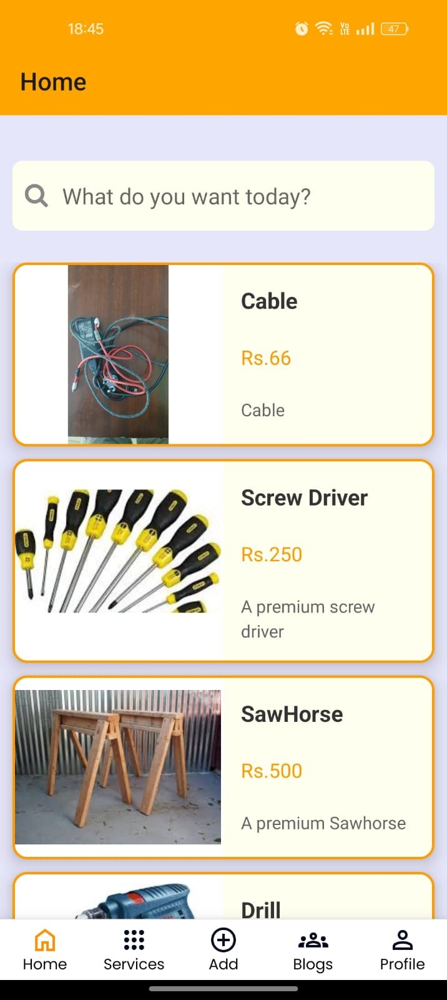
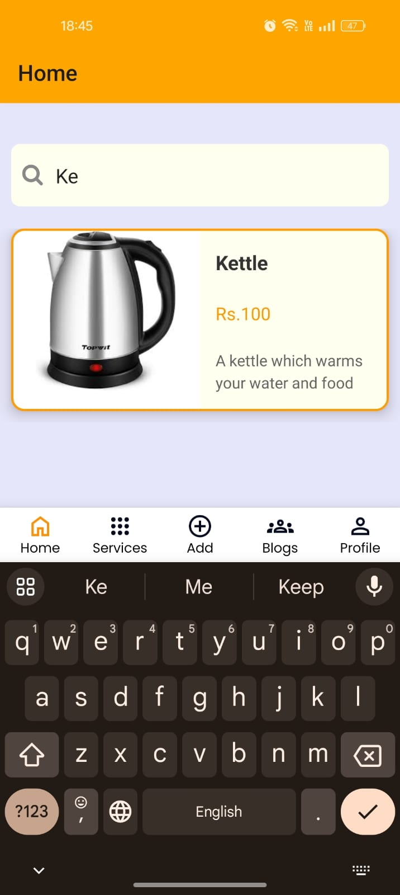
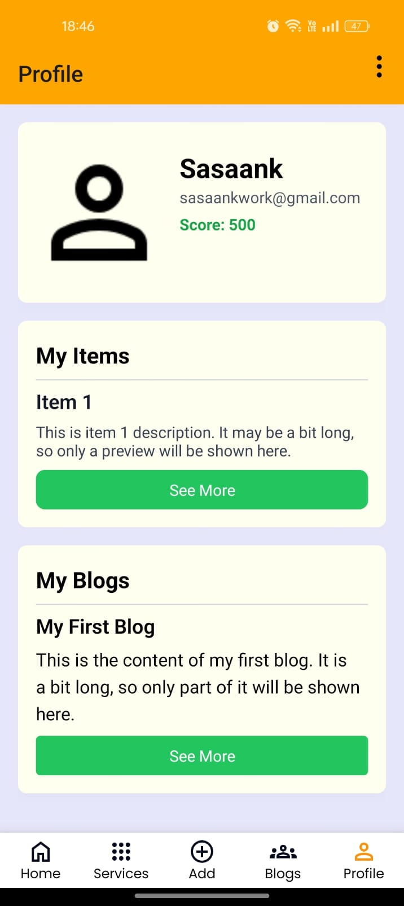
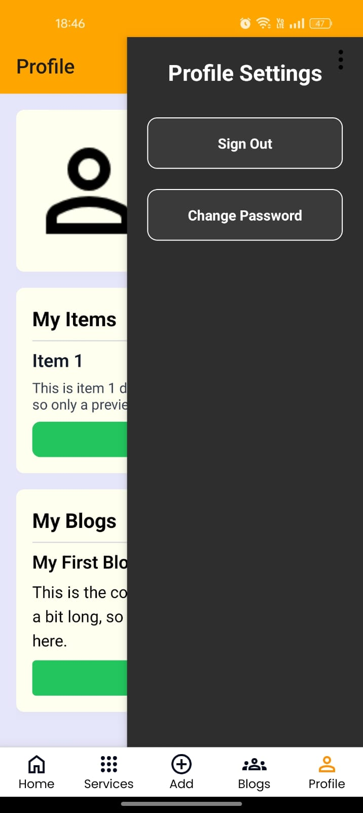
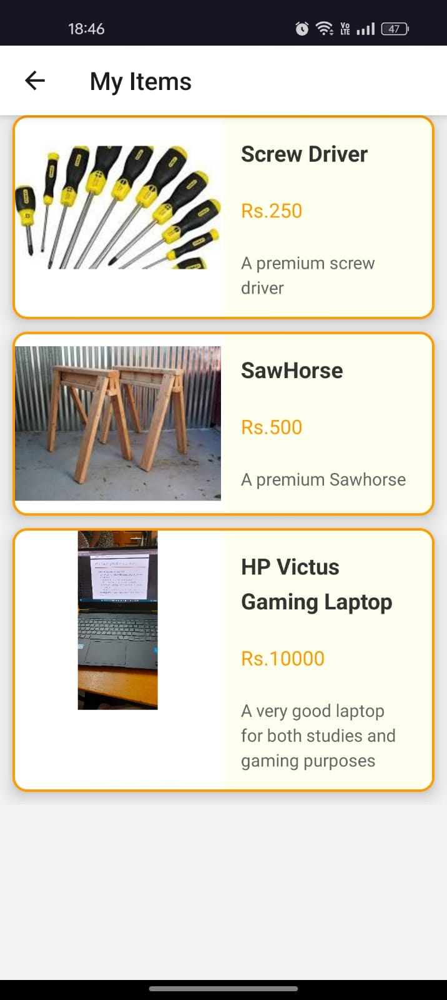

# Sahakara App
## Description
A platform that enables users to lend, borrow, and exchange goods and services locally. By promoting the sharing and reuse of items, the platform reduces new purchases and waste (SDG 12) while fostering community engagement and resilience (SDG 11). 

## App Documentation
### Sign In Page

### Sign Up Page

### Home Page

### Search Bar

### Item Description

### Services Page

### Blogs Page

### Likes In Blog Page

### Profile Page

### Side Bar Menu 

### My items Page

## Contribution
### Mokshith

* Blog Page
* Profile Page
* Profile Settings Menu
* Refactoring: Home Page, Item Description Page
* UI Design

### Sasaank

* Sign-In Page
* Sign-Up Page
* Services Page
* My Blogs, Items
* Backend
* Add Services

### Sonith

* Home Page
* Search Bar
* Navigtion Bar
* Item Description Page
* Bug Fixes
* APK Bundling

### Pavan

* Add Items Page
* Bug Fixing
* Appwrite Data Handling

### Akshatha

* Added Sign-Out feature
* Refactoring Profile Settings
* Appwrite Data Handling

### Venkat

* Change Password
* Appwrite Data Handling
* Add Blog

