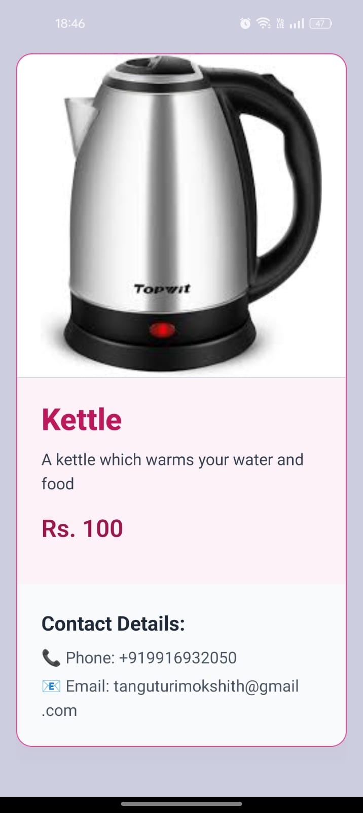
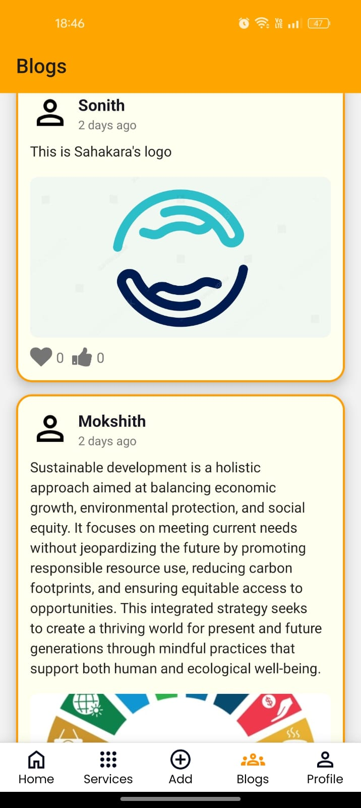
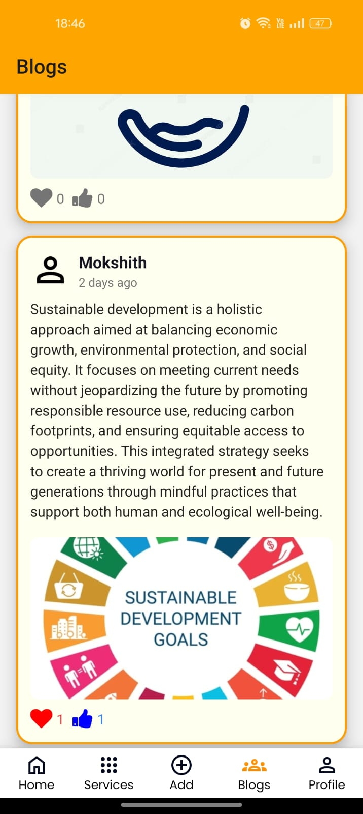

# Sahakara App

## Description

**Sahakara** is a platform that enables users to lend, borrow, and exchange goods and services locally. By promoting the sharing and reuse of items, the platform helps to reduce new purchases and waste, contributing to Sustainable Development Goal (SDG) 12: Responsible Consumption and Production. Additionally, it fosters community engagement and resilience, aligning with SDG 11: Sustainable Cities and Communities.

### Tech Stack:

- **React-Native**
- **Expo**
- 

### Features

- **Sign In/Sign Up:** Easily sign in or sign up to start using the platform.
- **Home Page:** Browse available items in your local community.
- **Search Bar:** Quickly find the items or services you're looking for.
- **Item Description:** View detailed information about an item, including its availability and the owner’s contact details.
- **Services Page:** Access a list of services that can be exchanged or offered.
- **Add Item/Service/Blog:** Share what you have or know with the community.
- **Profile Page:** Manage your personal information, see your items and services, and track your interactions.
- **Blog Page:** Share and read blogs related to community sharing and sustainability.
- **Likes in Blog Page:** Engage with the community by liking and commenting on blog posts.
- **Side Bar Menu:** Navigate through different sections of the app.
- **My Items Page:** Keep track of the items you’ve lent, borrowed, or exchanged.

### Screenshots

    

        <h3>Sign In Page</h3>
        
    

    

        <h3>Sign Up Page</h3>
        
    

    

        <h3>Home Page</h3>
        
    

    

        <h3>Search Bar</h3>
        
    

    

        <h3>Item Description</h3>
        
    

    

        <h3>Services Page</h3>
        
    

    

        <h3>Add Item Page</h3>
        
    

    

        <h3>Add Blog Page</h3>
        
    

    

        <h3>Add Service Page</h3>
        
    

    

        <h3>Blogs Page</h3>
        
    

    

        <h3>Likes In Blog Page</h3>
        
    

    

        <h3>Profile Page</h3>
        
    

    

        <h3>Side Bar Menu</h3>
        
    

    

        <h3>My Items Page</h3>
        
    

### Contribution

#### Mokshith
- Blog Page
- Profile Page
- Profile Settings Menu
- Refactoring: Home Page, Item Description Page
- UI Design

#### Sasaank
- Sign-In Page
- Sign-Up Page
- Services Page
- My Blogs, Items
- Backend
- Add Services

#### Sonith
- Home Page
- Search Bar
- Navigation Bar
- Item Description Page
- Bug Fixes
- APK Bundling

#### Pavan
- Add Items Page
- Bug Fixing
- Appwrite Data Handling

#### Akshatha
- Added Sign-Out feature
- Refactoring Profile Settings
- Appwrite Data Handling

#### Venkat
- Change Password
- Appwrite Data Handling
- Add Blog

## Getting Started

### Prerequisites

- Node.js and npm installed on your machine.
- An Appwrite server for backend services.
- Expo to build the app locally or in expo cloud.

